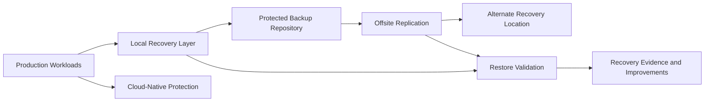

# Backup & Recovery — Illustrative Reference Model

> This model uses fictional service names and deliberately omits production settings.

## Recovery design questions

1. Which services are most important to operations?
2. What data loss is tolerable for each service?
3. How long can each service remain unavailable?
4. Which dependencies must recover first?
5. What happens if the primary site or identity platform is unavailable?
6. How is successful restoration demonstrated?
7. Who owns the decision to invoke recovery?

## Good-practice themes

- Multiple protection layers
- Separation of production and backup risk
- Offsite resilience
- Tested restoration
- Dependency-aware recovery order
- Clear ownership and documentation
- Continual improvement after each test or incident
