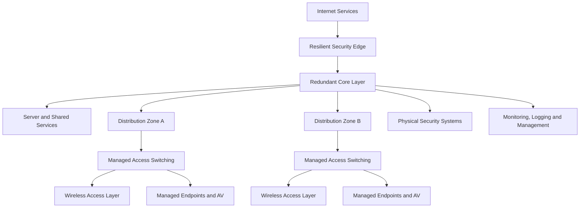

# Network Modernisation — Illustrative Reference Model

> This is a fictional, vendor-neutral reference model. It is not a production diagram.

## Design principles

- Separate edge security, core, distribution, and access responsibilities.
- Build redundancy around services with material operational impact.
- Treat wired, wireless, server, security, and audiovisual requirements as one system.
- Standardise management, documentation, monitoring, and lifecycle expectations.
- Phase implementation so that each stage creates usable operational value.
- Preserve expansion capacity in fibre, switching, power, space, and addressing design.

## Validation themes

- Failure and recovery behaviour
- Capacity and utilisation
- Coverage and roaming
- Segmentation and access policy
- Management-plane protection
- Monitoring and alert quality
- Documentation and support handover
