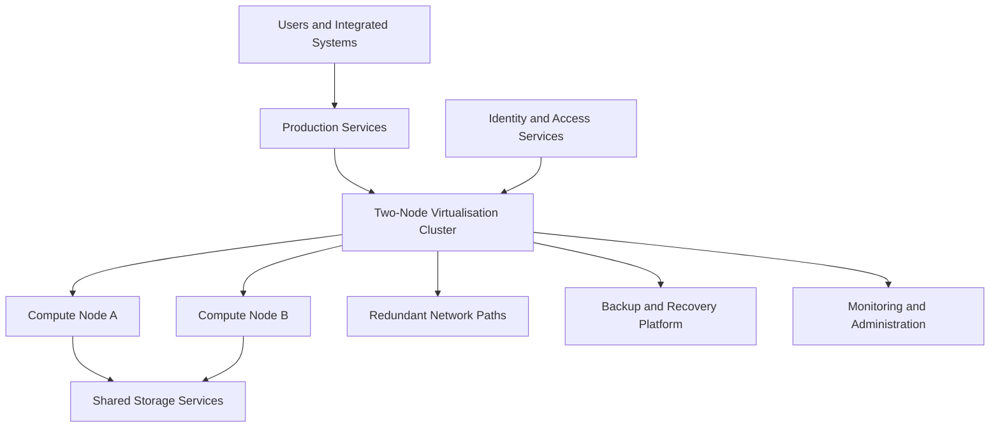

# Virtualisation Platform — Illustrative Reference Model

> This is a high-level reference model, not a production configuration.

## Operational considerations

- Workload and dependency inventory
- Compute, memory, storage, and network capacity
- Host and storage failure behaviour
- Identity, DNS, time, certificate, and licensing dependencies
- Backup integration and restore validation
- Patch, firmware, and maintenance sequencing
- Monitoring, alerting, and escalation
- Documentation and lifecycle planning

## Migration approach

1. Discover workloads and dependencies.
2. Classify business impact and migration risk.
3. Prepare compute, storage, networking, identity, and backup.
4. Migrate in controlled groups.
5. Validate infrastructure and user-facing service.
6. Preserve rollback options until acceptance.
7. Update recovery, monitoring, and support documentation.
